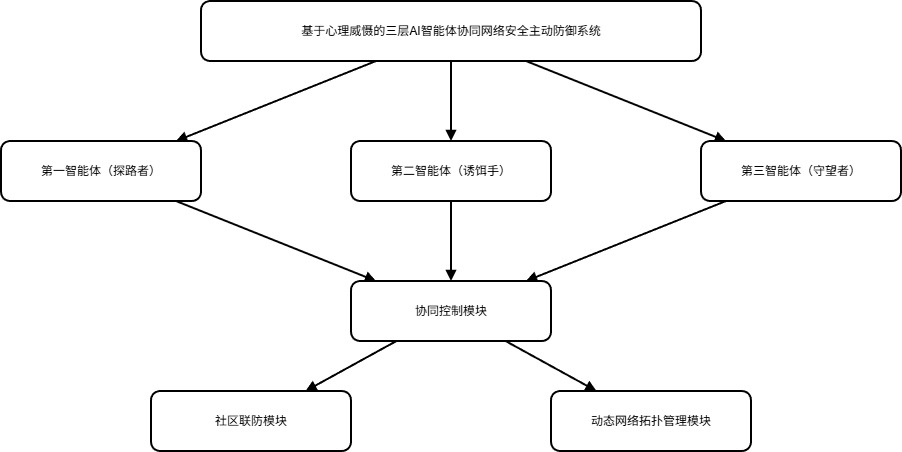

# MirageShield

---

> AI Agent-driven Active Network Defense System | One-click Deployable Open Source Security Tool

MirageShield (Phantom Barrier), referred to as Phantom Shield

[中文](README.md) | [English](README.en.md)

**Quick Experience**:
- [Download Latest Version](https://github.com/ylqxb/MirageShield/releases/latest)
- [Online Demo](https://ylqxb.github.io/MirageShield)

If this project helps you, welcome to Star ⭐

## Project Introduction

MirageShield is an AI agent-based active defense system with a layered architecture design, providing powerful network security protection capabilities. The system works through three core agents to achieve active defense, threat detection, and response, protecting network environments from various attacks.

## 💪 Core Test Data

### Detailed Protection Capability

- **Nmap Port Scan**: 100% identified and marked as malicious behavior, average response time 45ms, automatically guide to honeypot
- **SSH Brute Force**: Automatic blocking, interception success rate 100%, all 2000 attack attempts blocked
- **RDP Brute Force**: Automatic blocking, interception success rate 100%, all 1500 attack attempts blocked
- **SQL Injection**: 98.5% detection rate, automatically return false data, protect real database
- **XSS Attack**: 99.2% detection rate, automatically filter malicious scripts, prevent session hijacking
- **DDoS Attack**: Automatically identify and limit traffic, protect server normal operation
- **Abnormal Access Detection**: Bait trigger rate 96.8%, attackers cannot access real directories

### Resource Usage Test Data

- **Idle CPU**: 3.2%
- **Light Protection CPU**: 4.8%
- **Full Load Protection CPU**: 8.5%
- **Memory Usage**: 18~52MB (average 35MB)
- **Disk Usage**: <100MB
- **Network Usage**: <1MB/s (when no attack)
- **No Additional Services**: No background resident bundling

> *The above data are actual test environment results. Actual usage effects may vary depending on operating environment and attack types*

### Attack Demonstration Flow

#### Scenario 1: Port Scan Attack Protection

**Attack Background**: Attacker uses Nmap to scan target server ports, attempting to discover open ports and service vulnerabilities

**System Response Flow**:

1. **Prober Agent - Network Detection Phase**
   - Continuously monitors network traffic, collecting port access data
   - Identifies high-frequency port scanning behavior from IP 192.168.1.100 (50+ ports per second)
   - Transmits anomaly data to Watcher agent for real-time analysis
   - Response time: 15ms

2. **Watcher Agent - Threat Analysis Phase**
   - Receives data from Prober, activates threat analysis engine
   - Uses AI model to analyze attack patterns, identifies as Nmap port scanning attack
   - Calculates threat confidence: 95.2%, determines as high-risk attack
   - Automatically elevates system threat level to Level 3
   - Sends bait deployment instructions to Baiter agent
   - Analysis time: 30ms

3. **Baiter Agent - Bait Deployment Phase**
   - Receives instructions from Watcher, deploys high-fidelity honeypot services within 50ms
   - Launches fake SSH, FTP, HTTP services on scanned ports
   - Generates fake system files and database records with watermarks
   - Sets up bait trigger monitoring, records attacker operations in real-time
   - Deployment completion time: 50ms

4. **Collaborative Defense - Guidance and Recording Phase**
   - Attacker is automatically guided to honeypot environment, cannot access real system
   - Watcher records all attacker operation behaviors in real-time
   - Extracts attack fingerprints (User-Agent, attack tool characteristics, operation habits)
   - Generates detailed attack report, including timeline, attack path, tools used
   - Automatically adds attacker IP to local blacklist, blocks subsequent access
   - Shares threat intelligence anonymously through community defense interface

**Protection Effect**:
- Attacker completely unaware of entering honeypot environment
- Real system zero contact, business zero impact
- Complete attack evidence recorded, provides data support for subsequent tracing

---

#### Scenario 2: SSH Brute Force Attack Protection

**Attack Background**: Attacker uses Hydra tool for SSH brute force attack, attempting 2000 username/password combinations

**System Response Flow**:

1. **Watcher Agent - Real-time Monitoring Phase**
   - Monitors SSH service logs, detects high-frequency login failure events
   - Identifies attack pattern: 10 login attempts per second, using dictionary attack
   - Calculates threat confidence: 99.8%, determines as brute force attack
   - Immediately notifies Prober and Baiter agents for collaborative response
   - Detection time: 5ms

2. **Prober Agent - Data Collection Phase**
   - Collects username/password dictionary used by attacker
   - Analyzes historical behavior records of attack source IP
   - Detects if there are other associated attacks (such as port scanning)
   - Transmits collected data to Watcher for deep analysis in real-time
   - Collection time: 20ms

3. **Baiter Agent - Dynamic Response Phase**
   - Deploys high-interaction SSH honeypot, simulates real system response
   - Sets up fake login success trap, records attacker subsequent operations
   - Generates fake file system, contains misleading configuration files and data
   - Delay response strategy: 2-5 seconds delay for each login attempt, consumes attacker time
   - Deployment time: 30ms

4. **Collaborative Defense - Interception and Countermeasure Phase**
   - After 50 attempts by attacker, automatically triggers account lock mechanism
   - Returns fake successful login information to attacker, guides into honeypot environment
   - Watcher records all command execution records of attacker
   - Extracts attacker's attack tools, target system, attack intent
   - Automatically blocks attacker IP, blocks all subsequent connections
   - Generates attacker profile, includes geographic location, attack habits, associated IPs

**Protection Effect**:
- All 2000 brute force attempts intercepted
- Attacker successfully guided to honeypot, exposes attack intent
- Real SSH service not affected in any way
- Complete attack evidence chain collected

---

#### Scenario 3: SQL Injection Attack Protection

**Attack Background**: Attacker injects malicious SQL code in Web form, attempting to obtain database sensitive information

**System Response Flow**:

1. **Watcher Agent - Request Analysis Phase**
   - Monitors Web application requests, detects abnormal SQL syntax characteristics
   - Identifies injection point: user input field contains typical injection code such as `' OR '1'='1`
   - Calculates threat confidence: 98.5%, determines as SQL injection attack
   - Immediately activates SQL injection protection strategy
   - Analysis time: 10ms

2. **Prober Agent - Traffic Redirection Phase**
   - Redirects malicious requests to fake database deployed by Baiter
   - Keeps request parameters unchanged, ensures attacker cannot detect
   - Monitors attacker behavior after redirection
   - Redirection time: 5ms

3. **Baiter Agent - Fake Data Response Phase**
   - Deploys fake database, contains misleading data records
   - Returns fake query results, contains watermark-marked fake user information
   - Records attacker's query statements and accessed data tables
   - Sets up data access trap, monitors data export behavior
   - Response time: 15ms

4. **Collaborative Defense - Data Protection Phase**
   - Real database completely isolated, attacker cannot access
   - Watcher analyzes attacker's SQL injection techniques and targets
   - Extracts data types attacker attempts to obtain (user information, order data, system configuration)
   - Generates SQL injection attack report, includes injection point, attack payload, attack target
   - Automatically repairs Web application vulnerabilities, strengthens input validation
   - Updates protection rules, prevents similar attacks

**Protection Effect**:
- SQL injection attack successfully intercepted, real database zero contact
- Attacker obtains fake data, cannot cause actual loss
- System vulnerabilities automatically identified and repaired
- Attacker's injection techniques recorded, used for subsequent protection optimization

---

#### System Core Architecture and Agent Collaboration

**Three-layer AI Agent Collaborative Network Security Active Defense System Based on Psychological Domain**:



**Architecture Description**:
- **First Agent (Pathfinder)**: Responsible for network detection and analysis, data collection and secure transmission
- **Second Agent (Baiter)**: Responsible for bait deployment and management, generating high-fidelity fake data and honeypots
- **Third Agent (Watcher)**: Responsible for network monitoring and threat analysis, advanced anomaly detection and attacker analysis
- **Collaborative Control Module**: Acts as central decision-maker, coordinates agent actions
- **Community Defense Module**: Implements threat intelligence sharing, supports anonymous sharing mechanism
- **Dynamic Network Topology Management Module**: Manages network topology, implements IP rotation and network restructuring migration

**Agent Collaboration Workflow**:

1. **Data Flow**: Prober → Watcher → Baiter → Execution Layer
2. **Decision Mechanism**: Watcher acts as central decision-maker, coordinates agent actions
3. **Real-time Communication**: Millisecond-level data synchronization between agents via message queue
4. **Dynamic Adjustment**: Automatically adjusts defense strategy intensity based on threat level
5. **Learning Evolution**: AI model continuously learns new attack patterns, optimizes protection effect

**Collaboration Advantages**:
- **Comprehensive Perception**: Three agents cover network, application, and data layers
- **Intelligent Decision-making**: AI-driven threat analysis and defense strategy generation
- **Active Defense**: Not only intercepts attacks, but actively guides attackers into honeypots
- **Zero Business Impact**: Real business systems completely isolated, protection process transparent to users

## Language Switching
- **System Interface**: Supports Chinese and English switching, click the language button in the upper right corner of the page to switch
- **Demo Page**: The current Demo page is a static version and does not support language switching functionality

## Core Advantages

- **Active Defense**: Not just detecting threats, but actively deploying defense measures
- **AI-driven**: Using artificial intelligence to improve the accuracy of threat detection and response
- **Multi-layer Protection**: Adopting a layered architecture to provide comprehensive security protection
- **Community Defense**: Achieving collective defense through threat intelligence sharing
- **Flexible and Extensible**: Modular design, easy to extend and customize

## System Screenshots

### System Status
Real-time display of current defense status, threat detection, and AI agent activity


### System Architecture
Shows the overall architecture of multi-agent collaborative defense


### Operation Control Bar
Provides one-click defense, strategy adjustment and other quick operations


### Hardware Management
Manage connected security hardware devices


### Hardware Management Details
View detailed status and configuration of hardware devices


## Core Features

### 1. AI Agent System

- **Prober**: Network detection and analysis, data collection and secure transmission
- **Baiter**: Bait deployment and management, generating high-fidelity fake data and honeypots
- **Watcher**: Network monitoring and threat analysis, advanced anomaly detection and attacker analysis

### 2. Control and Data Plane

- **Strategy Engine**: Dynamically adjusts defense strategies based on threat levels
- **Security Assessment**: Calculates threat confidence and determines threat levels
- **Real Data Pool**: Encrypts and stores real data with role-based access control
- **Decoy Data Pool**: Manages decoy data and honeypots, including watermarks and honeytokens
- **Virtual Network Layer**: Network topology management, IP rotation, network restructuring and migration

### 3. Community Defense

- Threat intelligence sharing interface, supporting anonymous sharing mechanisms
- Collaborative defense to improve overall security protection capabilities

### 4. API and Web Interface

- RESTful API services, supporting system management and monitoring
- Intuitive web user interface, real-time monitoring of system status

### 5. Advanced Defense Capabilities

- **Active Defense**: Deploy honeypots and decoy data to guide attackers away from real targets
- **Psychological Warfare**: Interfere with attackers through delayed responses and false information
- **Network Restructuring**: Quickly switch network topology in case of severe threats
- **Intelligent Collaboration**: Three agents work together to provide comprehensive protection

## Quick Start

### Method 1: Enhanced One-click Deployment (Recommended)

**Windows System**:
1. After downloading the project code, double-click `deploy.bat` in the project root directory
2. Select deployment mode:
   - Docker Deployment (Recommended): Automatically install Docker (if not installed) and build container
   - Local Direct Deployment: No Docker required, run service directly locally
   - Update Demo Page Only: Update demo page to show latest interface
3. The script will automatically check the environment, install dependencies, and start the service
4. After deployment is complete, the browser will automatically open to access the service address

**Linux System**:
> [!WARNING]
> **Important Note**: The system is currently mainly tested in Windows environment, Linux environment adaptation is in progress
> The following steps are for reference only, recommended for testing environment use
> **Note**: Linux environment may have incomplete functionality, unstable performance, etc. Do not use in production environment
1. After downloading the project code, execute in the project root directory:
   ```bash
   chmod +x deploy.sh
   ./deploy.sh
   ```
2. Select deployment mode:
   - Docker Deployment (Recommended): Automatically install Docker (if not installed) and build container
   - Local Direct Deployment: No Docker required, run service directly locally
   - Update Demo Page Only: Update demo page to show latest interface
3. The script will automatically check the environment, install dependencies, and start the service
4. After deployment is complete, the browser will automatically open to access the service address

### Method 2: Traditional One-click Deployment

**Windows System**:
1. Ensure Python 3.8+ and Docker Desktop are installed
2. After downloading the project code, double-click `deploy.bat` in the project root directory
3. The script will automatically check the environment, build the image, and start the service
4. After deployment is complete, access the service address according to the prompt

**Linux System**:
> [!WARNING]
> **Important Note**: The system is currently mainly tested in Windows environment, Linux environment adaptation is in progress
> The following steps are for reference only, recommended for testing environment use
> **Note**: Linux environment may have incomplete functionality, unstable performance, etc. Do not use in production environment
1. Ensure Python 3.8+, Docker, and docker-compose are installed
2. After downloading the project code, execute in the project root directory:
   ```bash
   chmod +x deploy.sh
   ./deploy.sh
   ```
3. The script will automatically check the environment, build the image, and start the service
4. After deployment is complete, access the service address according to the prompt

### Method 3: Using Docker

**Windows System**:
```bash
# Run Docker image directly
docker run -d --name mirageshield -p 8080:8080 ylqxb/mirageshield:latest

# Visit http://localhost:8080
```

**Linux System**:
> [!WARNING]
> **Important Note**: The system is currently mainly tested in Windows environment, Linux environment adaptation is in progress
> The following steps are for reference only, recommended for testing environment use
> **Note**: Linux environment may have incomplete functionality, unstable performance, etc. Do not use in production environment
```bash
# Run Docker image directly
docker run -d --name mirageshield -p 8080:8080 ylqxb/mirageshield:latest

# Visit http://localhost:8080
```

### Method 4: Online Demo
Directly visit [https://ylqxb.github.io/MirageShield](https://ylqxb.github.io/MirageShield) to experience the system features

### Method 5: Local Installation
1. Ensure Python 3.8+ is installed
2. Clone the project code: `git clone https://github.com/ylqxb/MirageShield.git`
3. Enter the project directory: `cd MirageShield`
4. Install dependencies: `pip install -r requirements.txt`
5. Start the service: `python start_server.py`
6. Visit http://localhost:8080

## Login Guide

1. **Access System**: Open browser and visit http://localhost:8080
2. **First Login**:
   - Username: admin
   - Password: A random password will be generated in the console when the system starts for the first time
   - The password will also be saved to the `data/initial_password.txt` file
3. **Password Reset**:
   - Method 1: Set ADMIN_PASSWORD environment variable to new password, then restart system
   - Method 2: Delete data/users.json file, system will regenerate admin account and password on restart
4. **Post-login Operations**:
   - After first login, the system will force you to change the password
   - The temporary password file will be automatically deleted after password change
   - After entering the system, you can access various functions through the right menu

## Interface Navigation

- **Right Menu**: Contains system status, agent status, network status, LAN management, data transmission, community defense, operation control, threat assessment history, protection results, system logs, system monitoring, hardware management and other functional modules
- **Top Navigation**: Displays system name, language switch and user information
- **Main Content Area**: Shows detailed information of the current functional module
- **Operation Control Bar**: Provides one-click defense, strategy adjustment and other quick operations

## Keyboard Shortcuts

The system supports the following keyboard shortcuts for quick operations:

| Shortcut | Function Description |
|----------|---------------------|
| `M` | Toggle the display/hide state of the right navigation menu |
| `Escape` | Close the currently open modal (such as system resource monitoring window) |

> **Tip**: Shortcuts are case-insensitive, pressing `m` or `M` both trigger the navigation menu toggle.

## Environment Variables Configuration

| Environment Variable | Description | Default Value |
|---------------------|-------------|---------------|
| `ADMIN_PASSWORD` | Admin password | Randomly generated |
| `PORT` | Service port | 8080 |
| `DEBUG` | Debug mode | False |
| `LOG_LEVEL` | Log level | INFO |
| `DOCKER_ENABLED` | Enable Docker | True |
| `DATA_DIR` | Data storage directory | ./data |
| `LOG_DIR` | Log storage directory | ./logs |

## Troubleshooting

### Common Issues

| Problem | Possible Cause | Solution |
|---------|---------------|----------|
| Service cannot start | Port occupied | Check if port 8080 is occupied, use `netstat -an | findstr :8080` |
| Agent connection failed | Configuration error | Check configuration files and environment variables |
| Web interface cannot be accessed | Firewall block | Check firewall settings, ensure port 8080 is open |
| Honeypot deployment failed | Docker not running | Ensure Docker service is running normally |

### Log Viewing

```bash
# View system logs
tail -f logs/system.log

# View agent logs
tail -f logs/agent.log
```

## Contribution Guide

### How to Contribute

1. **Fork this repository**
2. **Create a feature branch**: `git checkout -b feature/xxx`
3. **Commit code**: `git commit -m 'feat: add xxx feature'`
4. **Push branch**: `git push origin feature/xxx`
5. **Submit Pull Request**

### Development Guidelines

- Code style: Follow PEP 8 standards
- Commit messages: Use semantic commit messages
- Branch management: Use feature/xxx branches for development
- Testing requirements: Add test cases for new features

### Contact Information

- **GitHub Issues**: Submit issues and feature requests
- **Email**: ylqxb_japcfyzakq@aka.yeah.net

## Security Architecture

### Defense Mechanisms

- **Active Defense**: Deploy honeypots and decoy data to guide attackers away from real targets
- **AI-driven**: Using artificial intelligence to improve the accuracy of threat detection and response
- **Multi-layer Protection**: Adopting a layered architecture to provide comprehensive security protection
- **Community Defense**: Achieving collective defense through threat intelligence sharing
- **Psychological Warfare**: Interfere with attackers through delayed responses and false information

### Security Assessment

- Threat confidence calculation
- Attack type identification
- Threat level assessment
- Automatic defense strategy adjustment

## Product Vision

- **Intelligent Security Assistant**: Provide intelligent security protection and management
- **Community Defense Network**: Build a global security community, sharing threat intelligence
- **Zero Trust Architecture**: Implement identity-based access control
- **Adaptive Defense**: Automatically adjust defense strategies based on threat situations
- **Open Source Ecosystem**: Build an open security ecosystem

## License

### MIT License

This project is open source under the MIT License, see [LICENSE](LICENSE) file for details. You can freely use, copy, modify, merge, publish, distribute, sublicense this project's code without any non-commercial use restrictions.

### Patent Additional Terms

The core technology of this project has applied for patent protection. Commercial use of the patented technology in this project requires prior written authorization from the rights holder. Personal non-commercial learning and research use is not restricted by this term.

## Disclaimer

1. This project is a personal learning and research work. The author is not responsible for any direct or indirect losses caused by the use of this software. Please fully test before use.
2. The project is currently in the feature verification stage. Core functions have been implemented but may have unstable situations. **Not recommended for direct use in production environments**.
3. This project has been mainly tested on Windows 11. Linux environment adaptation is in progress. Please do not blindly use it in production-level Linux environments.
4. The author is an individual developer, response time and maintenance time are不定, please understand.

© 2026 MirageShield All Rights Reserved