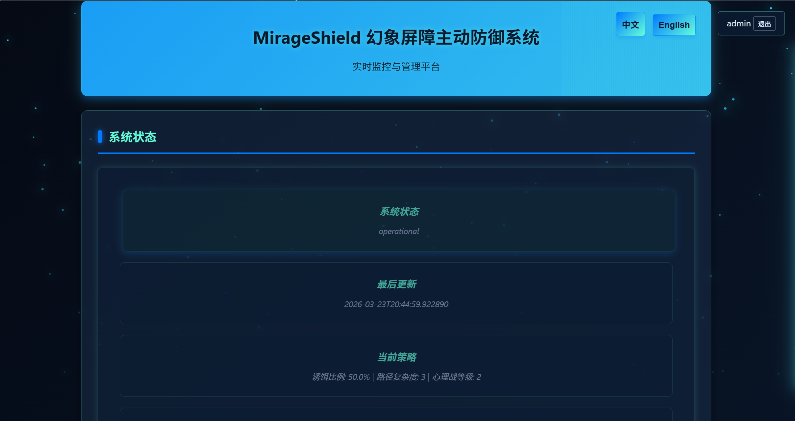
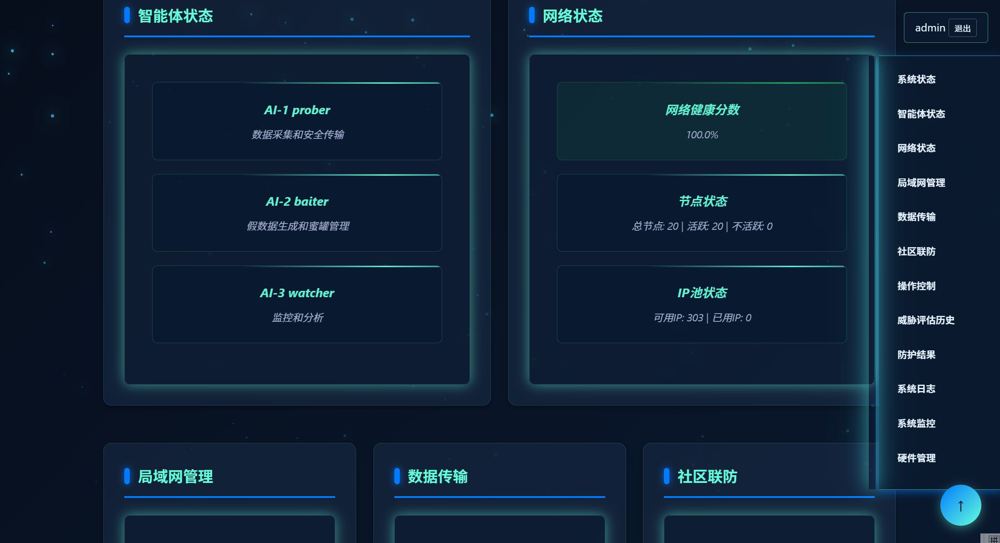
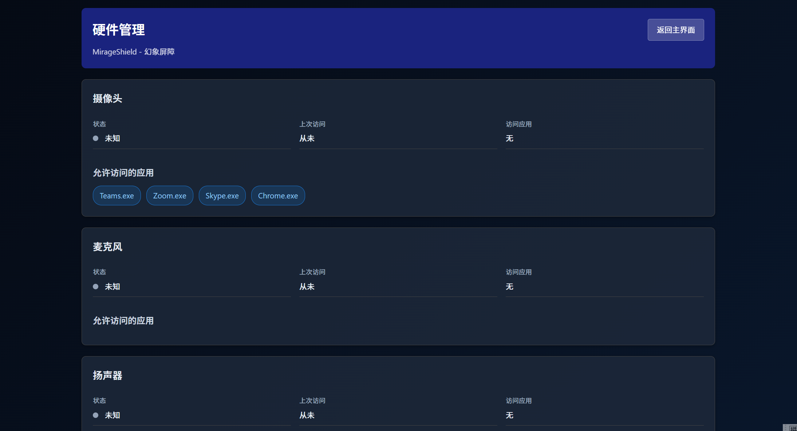

# MirageShield - Phantom Barrier

> AI Agent-based Active Defense System | Open Source Network Security Tool

[English](README.en.md) | [中文](README.md)

© 2026 MirageShield Team. All rights reserved.
The core technology of this project has applied for a patent (preliminary examination passed). The open-source version is for learning, testing, and non-commercial use only.

🚀 By using this project, you are deemed to have read, understood, and agreed to:
• Copyright statement and patent protection terms
• MIT open-source license agreement
• Project privacy policy
• Commercial use rules

## ⚠️ Project Status and Disclaimer

- **Personal Development Project**: This is a personal learning/research project. The author is not responsible for any direct or indirect losses caused by the use of this software. Please fully test before use.
- **Development Status**: In early development stage, features may be unstable, **not recommended for critical business environments**.
- **Testing Environment**: Only tested on Windows 11, not tested in Linux environment.
- **Maintenance Response**: The author is an individual developer, response time may vary, please understand.

## Reading Guide

To help you quickly understand and use MirageShield, we have categorized the documentation as follows, and recommend reading in this order:

### Getting Started
- [01_快速开始.md](./01_快速开始.md) - Quick deployment and usage guide
- [README.md](./README.md) - Project overview and core features

### Deployment
- [02_部署指南.md](./02_部署指南.md) - Detailed deployment steps and configuration

### Development
- [03_开发指南.md](./03_开发指南.md) - System architecture and development guidelines
- [04_运维指南.md](./04_运维指南.md) - System maintenance and troubleshooting
- [06_开发贡献指南.md](./06_开发贡献指南.md) - How to contribute to the project

### Reference
- [05_用户手册.md](./05_用户手册.md) - System functionality usage instructions
- [07_常见问题FAQ.md](./07_常见问题FAQ.md) - Frequently asked questions
- [PRIVACY_POLICY.md](./PRIVACY_POLICY.md) - Privacy policy
- [COMMERCIAL_DRAFT.md](./COMMERCIAL_DRAFT.md) - Commercialization planning draft

## Quick Navigation
- [Project Introduction](#project-introduction)
- [System Screenshots](#system-screenshots)
- [Core Features](#core-features)
- [Environment Preparation](#environment-preparation)
- [System Building Steps](#system-building-steps)
- [Module Building Guide](#module-building-guide)
- [Testing and Debugging](#testing-and-debugging)
- [Deployment Best Practices](#deployment-best-practices)
- [Quick Start](#quick-start)
- [Troubleshooting](#troubleshooting)
- [Performance Optimization](#performance-optimization)
- [Security Hardening](#security-hardening)
- [Core API Interfaces](#core-api-interfaces)
- [Configuration Instructions](#configuration-instructions)
- [Future Expansion Directions](#future-expansion-directions)
- [Contribution Guide](#contribution-guide)
- [License](#license)

## Project Introduction

MirageShield is an AI agent-based active defense system with a layered architecture design, providing powerful network security protection capabilities. The system works through three core agents to achieve active defense, threat detection, and response, protecting network environments from various attacks.

## System Screenshots

### System Status


### System Architecture


### Operation Control Bar


### Hardware Management


### Hardware Management Details


## Core Features

### 1. AI Agent System
- **Prober**: Network detection and analysis, data collection and secure transmission
- **Baiter**: Bait deployment and management, generating high-fidelity fake data and honeypots
- **Watcher**: Network monitoring and threat analysis, advanced anomaly detection and attacker analysis

#### AI Agent Implementation

MirageShield's AI agents adopt a hybrid implementation approach:

**1. Internal Agent Implementation**:
- Core functions are implemented through internal code, including network probing, threat monitoring, honeypot management, etc.
- Adopts asynchronous programming model, using Python asyncio to achieve efficient concurrent processing
- Built-in data collection, analysis, and processing logic to ensure system stability and reliability

**2. External API Integration**:
- Some advanced functions support calling external services through APIs, such as:
  - Generative AI: Used to generate high-fidelity bait content
  - IP reputation query: Used to assess network threats
  - Encryption services: Used for secure data transmission

**3. Modular Design**:
- Agents communicate through message queues to achieve loose coupling
- Supports simulation mode and real mode for easy development and testing
- Highly scalable, supporting the addition of new agents and functional modules

**4. Security Considerations**:
- Uses encrypted transmission to protect data security
- Uses proxies (such as Tor) to ensure anonymity
- Implements watermark and honeytoken technologies for tracking attackers

### 2. Control and Data Plane
- **Strategy Engine**: Dynamically adjusts defense strategies based on threat levels
- **Security Assessment**: Calculates threat confidence and determines threat levels
- **Real Data Pool**: Encrypts and stores real data with role-based access control
- **Decoy Data Pool**: Manages decoy data and honeypots, including watermarks and honeytokens
- **Virtual Network Layer**: Network topology management, IP rotation, network restructuring and migration

### 3. Community Defense
- Threat intelligence sharing interface, supporting anonymous sharing mechanisms
- Collaborative defense to improve overall security protection capabilities

### 4. API and Web Interface
- RESTful API services, supporting system management and monitoring
- Intuitive web user interface, real-time monitoring of system status

### 5. Advanced Defense Capabilities
- **Active Defense**: Deploy honeypots and decoy data to guide attackers away from real targets
- **Psychological Warfare**: Interfere with attackers through delayed responses and false information
- **Network Restructuring**: Quickly switch network topology in case of severe threats
- **Intelligent Collaboration**: Three agents work together to provide comprehensive protection

## Building a Complete System from Scratch

### Environment Preparation

#### 1. System Requirements
- **Operating System**: Windows 10+ (main test environment), Linux (experimental support, not fully tested)
- **Python**: 3.8~3.11 (recommended, 3.12+ may have asyncio compatibility issues)
- **Hardware**: At least 4-core CPU, 8GB memory, 50GB storage space
- **Network**: Stable network connection, supporting IPv4/IPv6
- **Docker**: Docker Engine 20.10+ (for deploying honeypots, optional but recommended)

#### 2. Software Installation

**Windows System**:
1. Install Python 3.8+: Download and install from [Python official website](https://www.python.org/downloads/)
2. Install Git: Download and install from [Git official website](https://git-scm.com/downloads)
3. Install Docker Desktop: Download and install from [Docker official website](https://www.docker.com/products/docker-desktop)
4. Configure environment variables: Ensure Python and Git are added to the system PATH

**Linux System** (**Not tested, not recommended**):

> [!WARNING]
> **Important Note**: The system has not been tested in Linux environment. **Do not blindly use it in Linux environment**
> The following steps are for reference only and may not work properly

```bash
# Install Python 3.8+
sudo apt update
sudo apt install python3 python3-pip python3-venv

# Install Git
sudo apt install git

# Install Docker
sudo apt install docker.io
sudo systemctl start docker
sudo systemctl enable docker
sudo usermod -aG docker $USER
```

### System Building Steps

#### 1. Code Acquisition
```bash
# Clone the code repository
git clone https://github.com/ylqxb/MirageShield.git
cd MirageShield

# Create virtual environment
python3 -m venv venv

# Activate virtual environment
# Windows
venv\Scripts\activate
# Linux
source venv/bin/activate

# Install dependencies
pip install -r requirements.txt

> [!TIP]
> If installation fails, it is recommended to upgrade pip: `pip install --upgrade pip`
> Linux systems may require `sudo` privileges
```

#### 2. System Configuration

**2.1 Environment Variable Configuration**

Create a `.env` file (in the project root directory):
```dotenv
# Admin password
ADMIN_PASSWORD=your_secure_password

# Encryption key
ENCRYPTION_KEY=your_encryption_key

# Watermark key
WATERMARK_KEY=your_watermark_key

# Optional: Tor control password
TOR_CONTROL_PASSWORD=your_tor_password

# Optional: IP reputation API key
IP_REPUTATION_API_KEY=your_ip_reputation_api_key

# Optional: OpenAI API key
OPENAI_API_KEY=your_openai_api_key
```

**2.2 Configuration File Adjustment**

Modify configuration files in the `config/` directory:

- `prober_config.json`: Prober agent configuration
- `baiter_config.json`: Baiter agent configuration
- `watcher_config.json`: Watcher agent configuration
- `api_config.json`: API-related configuration

**2.3 Directory Structure Creation**

Ensure the following directories exist:
```bash
# Create necessary directories
mkdir -p data logs backups

# Set directory permissions
chmod 755 data logs backups
```

#### 3. System Initialization

```bash
# Start the system
python start_server.py

# Check system status
curl http://localhost:5000/api/system/status

> [!TIP]
> Expected return result example:
> ```json
> {
>   "status": "running",
>   "agents": ["prober", "baiter", "watcher"],
>   "protection_level": 1,
>   "last_check": "2026-01-01 12:00:00"
> }
> ```
```

#### 4. Installation Verification

1. Access the web interface: http://localhost:5000
2. Log in with the set admin password
3. Check if the system status is normal
4. Test if each functional module works normally

### Module Building Guide

#### 1. AI Agent Modules

**Prober Agent**:
- Responsible for network probing and data collection
- Configuration file: `config/prober_config.json`
- Core functions: Network scanning, data collection, secure transmission

**Baiter Agent**:
- Responsible for bait deployment and management
- Configuration file: `config/baiter_config.json`
- Core functions: Honeypot deployment, fake data generation, bait management

**Watcher Agent**:
- Responsible for network monitoring and threat analysis
- Configuration file: `config/watcher_config.json`
- Core functions: Network monitoring, anomaly detection, threat analysis

#### 2. Control Plane Modules

**Strategy Engine**:
- Dynamically adjusts defense strategies based on threat levels
- Implementation file: `control_plane/strategy_engine.py`

**Security Assessment**:
- Calculates threat confidence and determines threat levels
- Implementation file: `control_plane/security_assessment.py`

**Layered Defense**:
- Implements multi-layer defense mechanisms
- Implementation file: `control_plane/layered_defense.py`

#### 3. Data Plane Modules

**Real Data Pool**:
- Encrypts and stores real data
- Implementation file: `data_plane/real_data_pool.py`

**Decoy Data Pool**:
- Manages decoy data and honeypots
- Implementation file: `data_plane/decoy_data_pool.py`

**Virtual Network Layer**:
- Network topology management, IP rotation
- Implementation file: `data_plane/virtual_network_layer.py`

#### 4. API and Web Interface

**API Service**:
- RESTful API interfaces
- Implementation file: `api/app.py`

**Web Interface**:
- Frontend pages
- Implementation file: `ui/index.html`

### Testing and Debugging

#### 1. Unit Testing

```bash
# Run unit tests
python -m pytest tests/

# View test coverage
python -m pytest tests/ --cov=.
```

#### 2. Integration Testing

```bash
# Start the system
python start_server.py

# Run integration tests
python tests/integration_test.py
```

#### 3. Debug Mode

```bash
# Start debug mode
FLASK_DEBUG=1 python start_server.py

> [!WARNING]
> Debug mode is only for development environments, prohibited in production environments
> Can specify host and port: `python start_server.py --host=0.0.0.0 --port=5000`
```

### Deployment Best Practices

#### 1. Local Development Environment
- Use virtual environment to isolate dependencies
- Enable debug mode for easy development
- Use mock data for testing

#### 2. Production Environment Deployment
- Use system service management (such as systemd)
- Configure reverse proxy (such as Nginx)
- Enable HTTPS encryption
- Regularly back up data
- Monitor system status

#### 3. Containerized Deployment

#### Using Docker Command
```bash
# Build Docker image
docker build -t mirageshield .

# Run container
docker run -d --name mirageshield \
  -p 5000:5000 \
  -v ./data:/app/data \
  -v ./logs:/app/logs \
  --env-file .env \
  mirageshield
```

#### Using Docker Compose
```bash
# Start service
docker-compose up -d

# Check service status
docker-compose ps

# Stop service
docker-compose down
```

### 4. Online Demo

The project provides an online demo, no environment installation required:
- **GitHub Pages**: [https://ylqxb.github.io/MirageShield](https://ylqxb.github.io/MirageShield)

### 5. Quick Start

#### Method 1: One-click Deployment (Recommended)

**Windows System**:
1. Ensure Python 3.8+ and Docker Desktop are installed
2. After downloading the project code, double-click `deploy_windows.bat` in the project root directory
3. The script will automatically check the environment, build the image, and start the service
4. After deployment is complete, access the service address according to the prompt

**Linux System**:
1. Ensure Python 3.8+, Docker, and docker-compose are installed
2. After downloading the project code, execute in the project root directory:
   ```bash
   chmod +x deploy_linux.sh
   ./deploy_linux.sh
   ```
3. The script will automatically check the environment, build the image, and start the service
4. After deployment is complete, access the service address according to the prompt

#### Method 2: Using Docker
```bash
# Run Docker image directly
docker run -d --name mirageshield -p 5000:5000 ylqxb/mirageshield:latest

# Visit http://localhost:5000
```

#### Method 3: Online Demo
Directly visit [https://ylqxb.github.io/MirageShield](https://ylqxb.github.io/MirageShield) to experience the system features

#### Method 4: Local Installation
Follow the environment preparation and system building steps above

### Troubleshooting

#### 1. Common Issues

| Problem | Possible Cause | Solution |
|---------|---------------|----------|
| Service cannot start | Port occupied | Check if port 5000 is occupied, use `netstat -an | findstr :5000` |
| Agent connection failed | Configuration error | Check configuration files and environment variables |
| Web interface cannot be accessed | Firewall block | Check firewall settings, ensure port 5000 is open |
| Honeypot deployment failed | Docker not running | Ensure Docker service is running normally |

#### 2. Log Viewing

```bash
# View system logs
tail -f logs/system.log

# View agent logs
tail -f logs/agent.log
```

#### 3. System Recovery

```bash
# Recover system
# 1. Stop service
# 2. Restore backup
python -c "from utils.backup import restore_users_data; restore_users_data()"
# 3. Restart service
python start_server.py
```

### Performance Optimization

#### 1. Hardware Optimization
- Use SSD storage to improve data access speed
- Increase memory to improve concurrent processing capabilities
- Use multi-core CPU to improve computing performance

#### 2. Software Optimization
- Enable caching mechanism to reduce redundant calculations
- Optimize database queries to improve response speed
- Use asynchronous programming to improve concurrent processing capabilities
- Configure appropriate log levels to reduce I/O overhead

#### 3. Network Optimization
- Use CDN to accelerate static resource access
- Optimize network topology to reduce network latency
- Use load balancing to improve system availability

### Security Hardening

#### 1. System Security
- Regularly update system and dependency packages
- Configure firewall to restrict access
- Use strong passwords and multi-factor authentication
- Regularly conduct security audits

#### 2. Data Security
- Encrypt storage of sensitive data
- Regularly back up data
- Implement data access control
- Use secure transmission protocols

#### 3. Application Security
- Implement input validation to prevent injection attacks
- Use HTTPS for encrypted transmission
- Regularly conduct vulnerability scanning
- Follow secure coding best practices

### Access Methods
- **Web Interface**: http://localhost:5000
- **API Interface**: http://localhost:5000/api

### Core API Interfaces

#### /api/system/status
- **Method**: GET
- **Description**: Get overall system status
- **Request Parameters**: None
- **Response Example**:
  ```json
  {
    "code": 200,
    "data": {
      "status": "running",
      "agents": ["prober", "baiter", "watcher"],
      "protection_level": 1,
      "last_check": "2026-01-01 12:00:00"
    },
    "msg": "success"
  }
  ```
- **Error Codes**: 401 (Unauthorized), 500 (System Exception)

#### /api/system/protection_level
- **Method**: POST
- **Description**: Set protection level
- **Request Parameters**:
  ```json
  {
    "level": 2
  }
  ```
- **Response Example**:
  ```json
  {
    "code": 200,
    "data": {
      "protection_level": 2
    },
    "msg": "success"
  }
  ```
- **Error Codes**: 400 (Parameter Error), 401 (Unauthorized), 500 (System Exception)

#### /api/agents
- **Method**: GET
- **Description**: Get agent list
- **Request Parameters**: None
- **Response Example**:
  ```json
  {
    "code": 200,
    "data": {
      "agents": [
        {"name": "prober", "status": "active"},
        {"name": "baiter", "status": "active"},
        {"name": "watcher", "status": "active"}
      ]
    },
    "msg": "success"
  }
  ```
- **Error Codes**: 401 (Unauthorized), 500 (System Exception)

#### /api/strategy
- **Method**: GET/POST
- **Description**: Get/set strategy
- **Request Parameters** (POST):
  ```json
  {
    "strategy": {
      "detection_level": "high",
      "response_mode": "automatic"
    }
  }
  ```
- **Response Example**:
  ```json
  {
    "code": 200,
    "data": {
      "strategy": {
        "detection_level": "high",
        "response_mode": "automatic"
      }
    },
    "msg": "success"
  }
  ```
- **Error Codes**: 400 (Parameter Error), 401 (Unauthorized), 500 (System Exception)

#### /api/assessment
- **Method**: POST
- **Description**: Conduct security assessment
- **Request Parameters**: None
- **Response Example**:
  ```json
  {
    "code": 200,
    "data": {
      "assessment": {
        "threat_level": "low",
        "vulnerabilities": [],
        "recommendations": []
      }
    },
    "msg": "success"
  }
  ```
- **Error Codes**: 401 (Unauthorized), 500 (System Exception)

#### /api/network/topology
- **Method**: GET
- **Description**: Get network topology
- **Request Parameters**: None
- **Response Example**:
  ```json
  {
    "code": 200,
    "data": {
      "topology": {
        "nodes": [],
        "edges": []
      }
    },
    "msg": "success"
  }
  ```
- **Error Codes**: 401 (Unauthorized), 500 (System Exception)

#### /api/community/sync
- **Method**: POST
- **Description**: Sync threat intelligence
- **Request Parameters**: None
- **Response Example**:
  ```json
  {
    "code": 200,
    "data": {
      "sync": {
        "status": "success",
        "updated_indicators": 10
      }
    },
    "msg": "success"
  }
  ```
- **Error Codes**: 401 (Unauthorized), 500 (System Exception)

#### /api/defense/layers
- **Method**: GET
- **Description**: Get defense layers
- **Request Parameters**: None
- **Response Example**:
  ```json
  {
    "code": 200,
    "data": {
      "layers": [
        {"name": "Boundary Defense", "status": "active"},
        {"name": "System Defense", "status": "active"},
        {"name": "Application Defense", "status": "active"}
      ]
    },
    "msg": "success"
  }
  ```
- **Error Codes**: 401 (Unauthorized), 500 (System Exception)

## Configuration Instructions

### Environment Variables
The following environment variables need to be set before running the system:
- `TOR_CONTROL_PASSWORD`: Tor control password
- `ENCRYPTION_KEY`: Encryption key
- `IP_REPUTATION_API_KEY`: IP reputation API key
- `OPENAI_API_KEY`: OpenAI API key
- `WATERMARK_KEY`: Watermark key
- `DEFAULT_PASSWORD`: Default password

### Configuration Files
- `config/prober_config.json`: Prober agent configuration
- `config/baiter_config.json`: Baiter agent configuration
- `config/watcher_config.json`: Watcher agent configuration
- `config/api_config.json`: API-related configuration

## Future Expansion Directions

### 1. Agent Enhancement
- **AI Model Upgrade**: Integrate more advanced AI models to improve threat detection and response capabilities
- **New Agent Development**: Add agents focused on specific threat types, such as IoT device protection, cloud service security, etc.
- **Cross-platform Support**: Extend agents to different operating systems and cloud environments

### 2. Function Expansion
- **Container Security**: Enhance security protection for container environments
- **Cloud Service Integration**: Integrate with security services of mainstream cloud service providers
- **Edge Device Protection**: Extend to security protection for edge computing devices
- **Blockchain Integration**: Use blockchain technology to enhance the security and reliability of threat intelligence sharing

### 3. Technical Innovation
- **Quantum Security**: Explore the application of quantum security technology in defense systems
- **Automated Response**: Implement more advanced automated threat response mechanisms
- **Predictive Analysis**: Machine learning-based threat prediction and prevention
- **Zero Trust Architecture**: Implement zero-trust security architecture integration

### 4. Ecosystem
- **Plugin System**: Develop an extensible plugin system to support third-party function integration
- **API Market**: Build an API market to promote the sharing and trading of security services
- **Community Contribution**: Establish an open-source community to encourage community contributions and collaboration

## System Function List

### Open Source Version Features
- **AI Agents**: Three core agents (Prober, Baiter, Watcher)
- **Active Defense**: Threat detection and active defense measures
- **Multi-layer Protection**: Layered defense architecture
- **Community Defense**: Threat intelligence sharing
- **Web Interface**: System status, hardware management, log viewing
- **API Interface**: Complete RESTful API
- **Data Encryption**: AES-256 encryption protection
- **Monitoring and Alerting**: Network and system monitoring
- **Honeypot Deployment**: Basic honeypot functionality
- **Configuration Management**: Flexible configuration system

### Commercial Version Reserved Features (Future Planning, Not Implemented)

> The above features are future plans, not yet implemented, and do not represent current version capabilities.

- **Advanced Threat Analysis**: AI model integration
- **Multi-tenant Management**: Enterprise-level deployment support
- **Professional Technical Support**: 7x24 technical support
- **Advanced Reporting**: Detailed security reports and analysis
- **Compliance Audit**: Industry-standard audit functionality
- **Third-party Integration**: Integration with existing enterprise systems

## Version Update Log

### v0.1.0 (2026-03-23)
- **Initial Version**: Project creation and core function implementation
- **AI Agents**: Implementation of three core agents (Prober, Baiter, Watcher)
- **Web Interface**: System status, hardware management, log viewing
- **API Interface**: Complete RESTful API
- **Active Defense**: Threat detection and active defense measures
- **Community Defense**: Threat intelligence sharing
- **Data Encryption**: AES-256 encryption protection
- **Configuration Management**: Flexible configuration system

## Core Advantages

- **Active Defense**: Not just detecting threats, but actively deploying defense measures
- **AI-driven**: Using artificial intelligence to improve the accuracy of threat detection and response
- **Multi-layer Protection**: Adopting a layered architecture to provide comprehensive security protection
- **Community Defense**: Achieving collective defense through threat intelligence sharing
- **Flexible and Extensible**: Modular design, easy to extend and customize

## Contribution Guide

### How to Contribute
1. **Fork this repository**
2. **Create a feature branch**: `git checkout -b feature/xxx`
3. **Commit code**: `git commit -m 'feat: add xxx feature'`
4. **Push branch**: `git push origin feature/xxx`
5. **Submit Pull Request**

### Code Standards
- Follow PEP 8 code style
- Use 4-space indentation
- Each line of code does not exceed 80 characters
- Add docstrings for functions and classes

### Issue Submission Process
1. Search existing Issues to ensure the issue has not been raised
2. Provide a detailed issue description
3. Include reproduction steps and expected behavior
4. Provide error logs or screenshots if possible

### Contact Information
- **GitHub Issues**: Submit issues and feature requests
- **Email**: ylqxb_japcfyzakq@aka.yeah.net

## License

### MIT License

```
MIT License

Copyright (c) 2026 MirageShield Team

Permission is hereby granted, free of charge, to any person obtaining a copy
of this software and associated documentation files (the "Software"), to deal
in the Software without restriction, including without limitation the rights
to use, copy, modify, merge, publish, distribute, sublicense, and/or sell
copies of the Software, and to permit persons to whom the Software is
furnished to do so, subject to the following conditions:

The above copyright notice and this permission notice shall be included in all
copies or substantial portions of the Software.

THE SOFTWARE IS PROVIDED "AS IS", WITHOUT WARRANTY OF ANY KIND, EXPRESS OR
IMPLIED, INCLUDING BUT NOT LIMITED TO THE WARRANTIES OF MERCHANTABILITY,
FITNESS FOR A PARTICULAR PURPOSE AND NONINFRINGEMENT. IN NO EVENT SHALL THE
AUTHORS OR COPYRIGHT HOLDERS BE LIABLE FOR ANY CLAIM, DAMAGES OR OTHER
LIABILITY, WHETHER IN AN ACTION OF CONTRACT, TORT OR OTHERWISE, ARISING FROM,
OUT OF OR IN CONNECTION WITH THE SOFTWARE OR THE USE OR OTHER DEALINGS IN THE
SOFTWARE.
```

### Additional Terms

The core technology of this project has applied for a patent (preliminary examination passed). The open-source version is for learning, testing, and non-commercial use only. Commercial use requires written authorization.

If this project has helped you, welcome to Star ⭐
